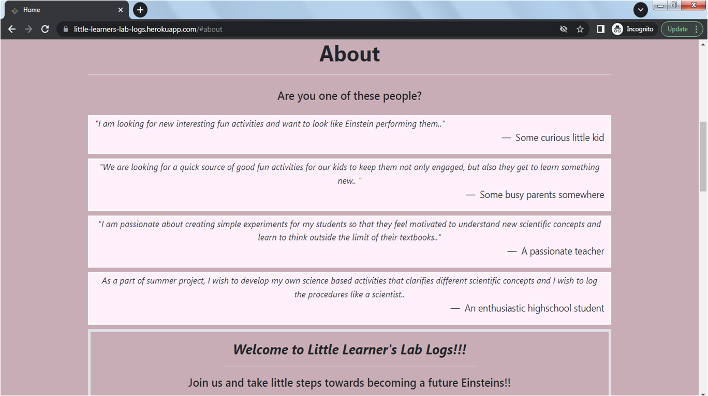
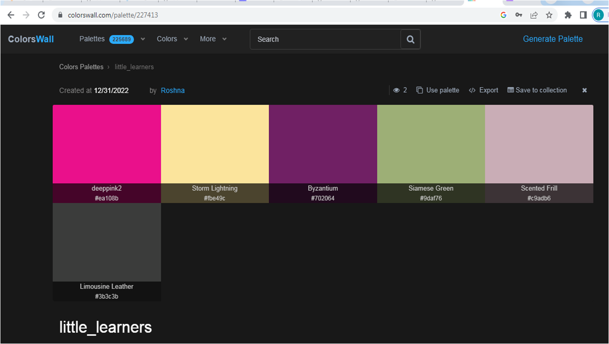

# Welcome to **[Little Learner's Lab Logs](https://little-learners-lab-logs.herokuapp.com/)**

## PERSPECTIVE
The main inspiration behind creating this website is a little curious learner, my little boy. When he started missing his normal visits to playgrounds during the winter break, he was on a constant lookout for activities around the house. Being among the large percentage of parents who wish to keep their kids engaged throughout the day, I started the quest of finding simple small fun activities that can be performed with the items available in the house. To find those activities, the best source is kids websites. Then followed a thought, what if one can perform the fun experiments and also can log the observations for others to read and repeat..  
With this idea, I created "Little Learner's Lab Logs" which started for a little learner and after its creation, I see that it appeals to all the little scientists hidden within us. The user of this website could be a little kid referring to these logs for fun or a student who wishes to learn and create logs of their own. Not to mention it's a great place for parents, who can help their kids learn new concepts along with having fun. And for teachers, this could be a site where their students can enter their observations and understand the scientific methodology better.  
The aim is to collect simple fun-filled small experiments for the Learners created by the Learners. 

## [Contents](#contents)
- [User Experience (UX)](#user-experience-ux)
	- [Site Goals](#site-goals)
	- [User Personas](#user-personas)
	- [Scope](#scope)
- [Agile Methodology](<#agile-methodology>)
    - [Epics and User Stories](<#epics-and-user-stories>)
        - [Website UI](<#website-ui>)
        - [Registration and Account Management](<#registration-and-account-management>)
		- [Lab Log Post Management](<#lab-log-post-management>)
		- [Comment and Like Management](<#comment-and-like-management>)
    - [Acceptance Criteria](<#acceptance-criteria>)
	- [Tasks](<#tasks>)
	- [User Story Management](<#user-story-management>)
- [Features](<#features>)
	- [Home Page](<#home-page>)
        - [Search Button](<#search-button>)
		- [Navbar](<#navbar>)
		- [Hero-image](<#hero-image>)
		- [About](<#about>)
		- [Getting Started](<#getting-started>)
		- [Latest Entries](<#latest-entries>)
		- [Footer](<#footer>)
	- [Lab Logs](<#lab-logs>)
		- [All Collections](<#all-collections>)
		- [Post Details](<#post-details>)
	- [My Page](<#my-page>)
		- [Add Logs](<#add-logs>)
		- [Edit Logs](<#edit-logs>)
		- [Delete Logs](<#edit-logs>)
	- [Sign Up](<#sign-out>)
	- [Sign In](<#sign-in>)
	- [Sign Out](<#sign-out>)
	- [Admin](<#admin>)
	- [General](<#general>)
		- [Security](<#security>)
		- [User Experience](<#user-experience>)
- [Design](<#design>)
	- [Colours](<#colours>)
	- [Typography](<#typography>)
	- [Imagery](<#imagery>)
	- [Wireframes](<#wireframes>)
    - [Database Schema](<#database-schema>)
- [Technologies](<#technologies>)
	- [Languages Used](<#languages-used>)
	- [Frameworks, Libraries and Programs](<#frameworks-libraries-and-programs>)
- [Production](#production)
	- [Django](<#django>)
- [Testing](<#testing>)
	- [Testing Technologies](<#testing-technologies>)
		- [Automated Testing](<#automated-testing>)
		- [Manual Testing](<#manual-testing>)
			- [Validation](<#validation>)
- [Bugs and Issues](<#bugs-and-issues>)
- [Deployment](<#deployment>)
	- [Heroku](<#heroku>)
- [Credits and Resources](<#credits-and-resources>)
	- [Code](<#code>)
	- [Learning Resources](<#learning-resources>)
	- [Content](<#content>)
	- [Media](<#media>)
- [Acknowledgements](<#acknowledgements>)

# User Experience (UX)

## Site Goals
- Little Learner's Lab Logs is a website mainly meant for curious kids of all ages, where they can explore, create activity logs and also post fun science experiments that could even be performed at home. 
- It is also an useful site for busy parents, who wish that their children to learn new scientific concepts through simple fun experiments. 
- It is also a place for those passionate teachers who want to encourage their students to be motivated to learn science and be intuitive about the scientific concepts around them. 
- All users who sign up and sign in, can access all the features of the website and can create, edit, and delete their posts.

## User Personas 
As mentioned in Site Goals, the users expected to be visiting this website regularly are going to be kids, students, parents and teachers. I created 4 fictional characters which represents the target users. The user personas with their needs, goals and frustrations are enlisted, which helped me design this website with a point of view of distinct users.
The link to User Personas can be found [here](docs/agile/user_personas.pdf).

## Scope
- An attractive and intuitive UX experience: 
	1. Website title focus kids as primany users
	2. Hero-image with information on the site's purpose
	3. Responsve design
	4. A clear and straightforward layout
	5. Footer fixed at the bottom with links to social media
	6. The user knows which page they are on by the name that appears on the head of each webpage.

- An easy navigation for the user through all the pages and features
	1. Navigation Menu with easy access to all links.
	2. Easy Sign Up/ Sign In/ Sign Out functionality visible.
	3. Content guiding users how to start using the websites features
	4. Description of features that would suite different users' needs 
	5. Hero image guidance to sign up/sign in

- Lab Log posts features
	1. Latest entries feature on the landing page
	2. Exclusive page for all the posts
	3. On a click they can view post details
	4. Ability to be able to search for posts
	5. Ability to comment on/like posts
	6. Create, Edit and Delete Posts
	7. Ability to add/edit and remove posts in user's personal page

## Agile Methodology
Throughout this project, an agile approach was taken in order to develop the website  Each activity was broken down into  manageable actions from initially creating 4 Epics, which were then broken down into smaller User Stories. Each of the user stories then had different acceptance criteria. The status, comments and details of each Epic along with the associated User Stories can be found in the kanban board linked [here](https://github.com/users/RoshnaVakkeel/projects/2/views/1). This made the overall project much more manageable to build. 

## Epics and User Stories
4 Epics were created which were further developed into 15 User Stories. The initial conception was done using google sheets. The link can be found [here](docs/agile/epics_and_user_stories.xlsx).

### Website UI
[Epic 01: Little_Learner's_Lab_Logs website UI #1](https://github.com/RoshnaVakkeel/Little_Learners_Lab_Logs/issues/1)
Epic Goals for End User:
1. An intuitive User Interface with easy to use navigation
2. A means of viewing the full list o blogs including likes
3. functionality to allow users to register, sign in and sign out
4. Upon signing in, the user should be able to like, comment on the blog posts

Related User Stories:
1. [USER STORY US01: Intuitive User Interface #2](https://github.com/RoshnaVakkeel/Little_Learners_Lab_Logs/issues/2):
	As a Site user I can see a well defined landing page so that I can easily understand the purpose and main features of the website.
2. [USER STORY US02: Site pagination#3](https://github.com/RoshnaVakkeel/Little_Learners_Lab_Logs/issues/3):
	As a Site user I can view a well paginated website so that navigate easily to different features offered.
3. [USER STORY US03: Log Posts Display#4](https://github.com/RoshnaVakkeel/Little_Learners_Lab_Logs/issues/4):
	As a Site user I can see the collection of log posts at a glance so that I can find the lab log posts of my choice.
4. [USER STORY US04: User Registration/Sign Up Link#5](https://github.com/RoshnaVakkeel/Little_Learners_Lab_Logs/issues/5):
	As a Site user I can easily see a registration button and sign up option so that I can register to access all create, edit and delete functions offered by the website.

### Registration and Account Management
[EPIC 02: Registration and Account Management #6](https://github.com/RoshnaVakkeel/Little_Learners_Lab_Logs/issues/6)
Epic Goals for End User:

1. Easy registration of an account
2. Easy Sign Up, Sign in and Sign Out
3. Confirmation upon signing in 
4. Upon signing in, the user should be able to like, comment on the lab log post posts
5. Easy access to Create, Read, Update and Delete (CRUD) features upon signing in
6. Visibility of personalized lab log post posts and comments

Related User Stories:
1. [USER STORY US05: Account Creation#7](https://github.com/RoshnaVakkeel/Little_Learners_Lab_Logs/issues/7):
As a Site user I can create an account by registering my details so that I can comment, like, create and edit lab log posts
2. [USER STORY US06: Account Confirmation #8](https://github.com/RoshnaVakkeel/Little_Learners_Lab_Logs/issues/8):
As a Site user I can I get a message upon signing up so that I can know that my account registration was successful.
3. [USER STORY US07: Sign In and Sign Out Features #9](https://github.com/RoshnaVakkeel/Little_Learners_Lab_Logs/issues/9): As a registered Site user I can easily Sign in or Sign Out so that I can access my personal posts and comments.
4. [USER STORY US 08: User Personal Page Features#10](https://github.com/RoshnaVakkeel/Little_Learners_Lab_Logs/issues/10):
As a registered Site user I can see my personal page so that I can create my own lab log post posts and edit or delete them.

### Lab Log Post Management
[EPIC 03: Lab Log Post Management#11](https://github.com/RoshnaVakkeel/Little_Learners_Lab_Logs/issues/11)

Epic Goals for End User:

1. Create lab log posts. 
2. View their created lab log posts
3. Update/Edit personalized lab log posts
4. Delete lab log posts

Related User Stories:
1. [USER STORY US09: Add Lab Log Posts#12](https://github.com/RoshnaVakkeel/Little_Learners_Lab_Logs/issues/12): As a signed-in Site user I can create a lab log post so that I can share my ideas and experiments
2. [USER STORY US 10: View/Read Lab Log Posts #13](https://github.com/RoshnaVakkeel/Little_Learners_Lab_Logs/issues/13): As a signed-in Site user who created a lab log post I can read my post with my name among other posts on homepage so that I can share my posts with others.
3. [USER STORY US 11: Edit Lab Log Posts #14](https://github.com/RoshnaVakkeel/Little_Learners_Lab_Logs/issues/14):As a signed-in site user I can edit and update a lab log post I created so that I can make additions, edit, correct the entries I made in the post.
4. [USER STORY US 12: Delete Lab Log Posts#15](https://github.com/RoshnaVakkeel/Little_Learners_Lab_Logs/issues/15): As a signed-in site user I can choose to delete a lab log post I created so that I publish only the posts of my choice.

### Comments and Like Management
[EPIC 04: Comments/Likes Management #16](https://github.com/RoshnaVakkeel/Little_Learners_Lab_Logs/issues/16)

Epic Goals for End User:
1. Add and see Comments 
2. Add/remove Likes

Related User Stories:
1. [USER STORY US 13: Post Comments #17 ](https://github.com/RoshnaVakkeel/Little_Learners_Lab_Logs/issues/17): As a signed-in site user I can add a comment on any lab log posts so that I can express my opinion about a topic of my choice.
2. [USER STORY US 14: Site Owners Approval of Comments #18](https://github.com/RoshnaVakkeel/Little_Learners_Lab_Logs/issues/18): As a site owner and admin I can review and then approve or disapprove comments so that unsuitable comment can be filtered out as children also would be site users.
3. [USER STORY US 15: Add or Remove Likes on a Post#19](https://github.com/RoshnaVakkeel/Little_Learners_Lab_Logs/issues/19): As a signed-in site user I can add like to the lab log posts I liked so that I can guide other users to select simple experiments that may be more interesting.

## Acceptance Criteria
For all the User Stories, Acceptance Criteria was also mentioned. The purpose of this was to provide a reference point for the developmental steps. I made sure to cross-check that all the required steps intended was implemented. It also helped with Testing to make sure that all the necessary aspects and features were covered. The acceptance criteria is described on the column next to the user stories (column H) [here](docs/agile/epics_and_user_stories.xlsx).

## Tasks
The tasks for the website development process was closely followed as mentioned in CI's Django module "I Think Therefore I Blog" walkthrough project.
The tasks during the development phase were carried out in this order.

## Features

### Home Page
Homepage provides the user with some quick information on how to start using the site and make use of all its features.  It helps them decide if they would like to continue to read the posts or create them. Users do not need to be registered to view a post. 

Homepage or the Landing page has these key features: 

Visible at first glimpse:
1. Search input field and button
2. Navigation Menu
3. Hero-image

Upon scrolling down (Links to navigate to these sections can be found on the hero-image caption):
1. About Section
2. Getting Started
3. Latest Entries

End of the page:
1. Back to Top Button
2. Footer

Details to each section has been provided below in detail.

#### Search Button 
On the top right corner, a search input field is provided along with a button to submit. User can search any query using keywords and a new search page will appear containing Search Results. Click [here](docs/features/search_result.png) to see it.

#### Navbar
The responsive navigation bar is featured on all pages. The purpose of this feature is to allow users to navigate all pages easily across all devices without having to use a back button to get to the next page. It has active links to different pages. For mobile view, the navbar transforms to a burger menu. 

Navbar features two types of views/ navigation menu items depending on if the user is logged in or logged out. 

If the user is not signed in or is signed out. The navbar will prompt to Sign Up, Sign In or log in as Admin. The navigation menu will appear as shown below. 

 
If the user is signed in (username Rose is provided as an example here). The navigation menu will appear as shown below. The navbar will in this case feature "User's" Page and Sign Out options.

This feature is introduced for better user guidance. 

### Hero-image
The Hero-image is introduced in a Carousel that enables a slideshow for cycling through elements. As the theme cannot be depicted in just a picture, my idea was to give three pictures with three captions. Th captions would also prompt the user to sign in or sign up. Besides that, it will also contain links to different sections within th homepage such as About and Getting Started for user guidance, and to Latest Entries section to draw user's attention to the different posts. The pictures with different links can be found .

### About
About section asks the users questions about which kind of user persona they associate with and helps them understand the ways they can make use of the different features of the website. It also presents a welcome note for the users. Check it out .

		- [Getting Started](<#getting-started>)
		- [Latest Entries](<#latest-entries>)
		- [Footer](<#footer>)
	- [Lab Logs](<#lab-logs>)
		- [All Collections](<#all-collections>)
		- [Post Details](<#post-details>)
	- [My Page](<#my-page>)
		- [Add Logs](<#add-logs>)
		- [Edit Logs](<#edit-logs>)
		- [Delete Logs](<#edit-logs>)
	- [Sign Up](<#sign-out>)
	- [Sign In](<#sign-in>)
	- [Sign Out](<#sign-out>)
	- [Admin](<#admin>)
	- [General](<#general>)
		- [Security](<#security>)
		- [User Experience](<#user-experience>)

## Design
### Colours
- The colour scheme has considered based on easy accessibility for all. 
- Complimentarity was key feature in color selection, to give it a pleasant feel for all age groups.
- The colors have been consistently maintained throughout the website.

The palette was generated with inspiration from palettes provided by [Lilybug Graphic Design -Colour Wall](https://www.lilybugdesign.co.nz/colour-wall)

The chosen palette of colors was generated from the graphic: 

The colours were modified using [Colorswall](https://colorswall.com/palette/227413). 
The colors were generated referring to the Tropical palette in colorswall palette Generator. The generated palette:

These were the colors for the body (scented frill - #c9adb6) and (variant of deep pink - #851050) was chosen for navbra and footer.

### Typography
- Fonts were imported using Google Fonts. Roboto was used throughout with a backup of sans-serif. It was chosen for easy readability for users. 
- UTF-8 Symbols 

### Imagery
The imagery on the website has been seleced according to young users. The images chosen depict children engaged in different activities. The pictures selected are with range of colors. Usually experiments are meant to be colorful. The carousel was chosen to show hero-image because one picture cannot represent the whole theme of the website.
All images were taken from [Pexels](https://www.pexels.com/).

### Wireframes
The wireframes were generated at the start of the project suing Balsamiq. After referring to different bootstrap templates, pages were divided into the different relevant sections. 
The finished website closely fololows wireframes as the designs were adapted during development but overall structure was kept constant. For eg. an additional 'About' section was introduced in order to guide the user. A search field and button was also introduced. 

The wireframes can be found in these links: 
[Wieframes for Desktop](docs/wireframes/PP4_project_wireframe_desktop.pdf) 
[Wieframes for Tablet](docs/wireframes/PP4_project_wireframe_tablet.pdf) 
[Wieframes for Mobile](docs/wireframes/PP4_project_wireframe_mobile.pdf)

### Database Schema
Smart Draw was used to create a database schema to visualise the types of custom models the project requires. This schema was used as a guide to what needed to be added to each model. Below is the Database structure that this project is based on. The relationship between Entities User, Post and Comment are shown here. 

- [Technologies](<#technologies>)
	- [Languages Used](<#languages-used>)
	- [Frameworks, Libraries and Programs](<#frameworks-libraries-and-programs>)

## Production
### Django Installation and Set Up
This website is built on the Django framework. To set up a Django project, the necessary dependencies were installed. This project uses the old versions as mentioned in CI's Django wakthrough project "I think therefore I blog"
This needs these steps to be followed:

Within the development environment, 
1. install Django using the command:
~~~
pip3 install 'django<4' gunicorn
~~~
This installs Django (the framework) and gunicorn (which is a WSGI HTTP server that will be used by the site).

2. Then install the libraries `psycopg2` and `dj_database_url==0.5.0 psycopg2` using the command line:
~~~
pip3 install dj_database_url==0.5.0 psycopg2
~~~
These libraries are needed for connecting to the database.

3. As this site uses Cloudinary to store files, this needs to be installed with:
~~~
pip3 install dj3-cloudinary-storage
~~~
This allows the site to use Cloudinary for storing and serving files

4. Once all the dependencies are installed, generate a requirements.txt document for them by using:
~~~
pip3 freeze --local > requirements.txt
~~~
This will store the dependencies of the project in a file called requirements.txt

5. Next, start a new Django project using the command:
~~~
django-admin startproject <project-name> .
~~~
(don't leave off the dot at the end as this determines where the project is created).

In my case, it was:
~~~
django-admin startproject little-learners-lab-logs .
~~~

6. Migrations need to be run to set the database up, this can be done with:
~~~
python3 manage.py migrate
~~~

7. Finally, you can commit and push your changes to GitHub using :
~~~
git add .
git commit -m "initial commit
git push
~~~

[Back to top ⇧](#contents)

## Testing
The testing is broken into categories: manual and validation. Details can be found below.

### Testing Technologies 
The website was manually tested the website on 3 different browsers: Chrome, Firefox and Edge. In all the browsers the website unctions very well. Only exception is Firefox Mozilla, where the Corousel wasn't functioning properly. It is addressed in the Issues section.
In addition, I also tested it on my own mobile with Safari search engine, and had a number of friends and family test it on their own devices. There are a number of accounts and lab log entries that already exist in the database which were created by diferent users. Their feedbacks were taken into account and improvements were made in the website.

This testing consisted of checking:

- The website functioned as expected
- Working of all the links
- Submission of forms
- JavaScript functioning
- Comments and posts addition
- Editing and delete functions

#### Manual Testing

#### Validation
I used the following validation tools

- HTML using [W3C HTML validator](https://validator.w3.org/)
- CSS using [Jigsaw CSS validator](https://jigsaw.w3.org/css-validator/)
- Site performance via [Lighthouse](https://developers.google.com/web/tools/lighthouse)
- Accessibility via [WAVE Web Accessibility Evaluation Tool](https://wave.webaim.org/)
- Python via [PEP8 CI Python Linter](https://pep8ci.herokuapp.com/)

Results obtained are as follows:

##### HTML Validation 
All the Django templates html files hava been validated by manually copying the source of the rendered pages and then validating using the W3C Validator (link shown above). Each test result shows the source url. The results can be seen [here](docs/validation/w3c_validation_results_html.pdf).

##### CSS Validation 
[Jigsaw CSS validator](https://jigsaw.w3.org/css-validator/) was used for validating the CSS stylesheet. CSS file was tested by manually copying the CSS codes into the manual input option. The result can be seen [here](docs/validation/w3c_validation_CSS.png).

##### Lighthouse Test
[Lighthouse](https://developers.google.com/web/tools/lighthouse) tool was used for analysing the performance, accessibility, best practices and SEO of the website. The results are summarised [here](docs/validation/lighthouse_report.pdf).

##### WAVE Accessibility Test
[WAVE Web Accessibility Evaluation Tool](https://wave.webaim.org/) was used to check web accessibility. Only the certain contrast errors were reported. It was due to link contrast with the background. I used primary link color blue in hero-image caption for better guidance for the user, so that they identify that it is a link rather than using black color as suggested by the tool. This error was deliberately ignored. No other errors were reported. The results can be found [here](docs/validation/wave_accessibility_test.pdf). 

##### PEP8 Python Linter Test
- [PEP8 CI Python Linter](https://pep8ci.herokuapp.com/) was used to check that the Python code meets PEP8 standards. All the errors were also checked periodically before git push to the repository. The tests results can be seen [here](docs/validation/pep8_validation.pdf). 

[Back to top ⇧](#contents)