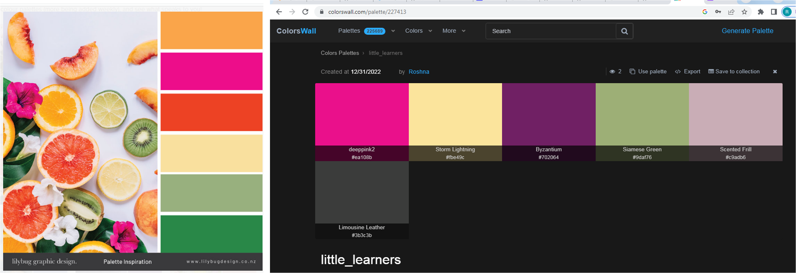
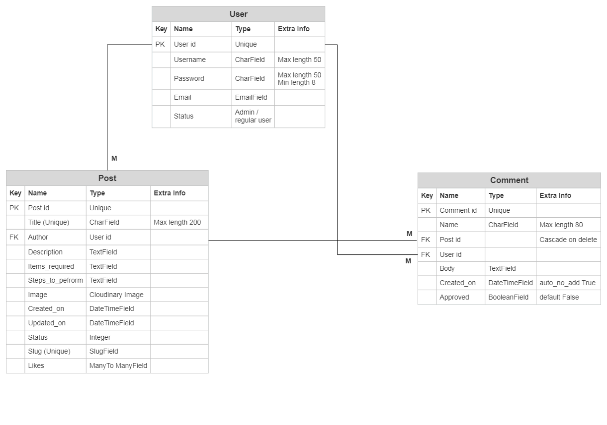
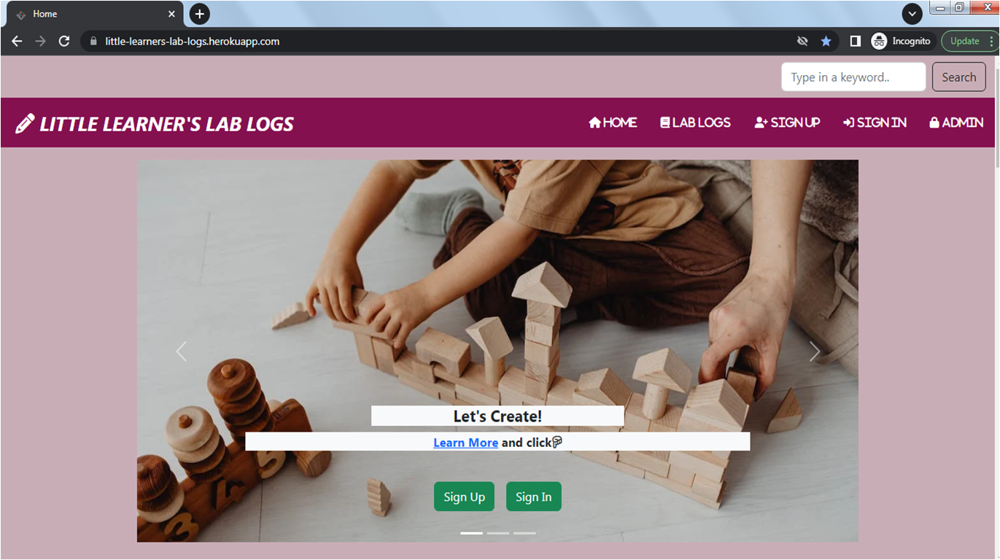
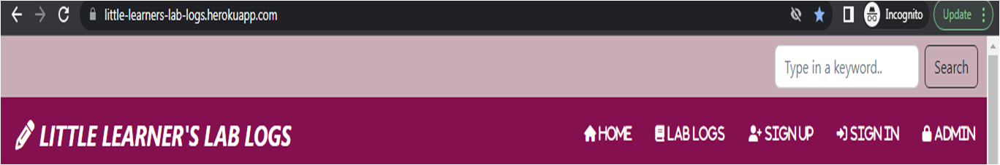
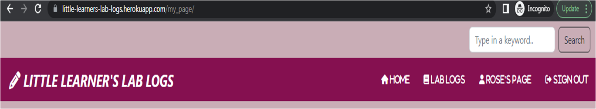
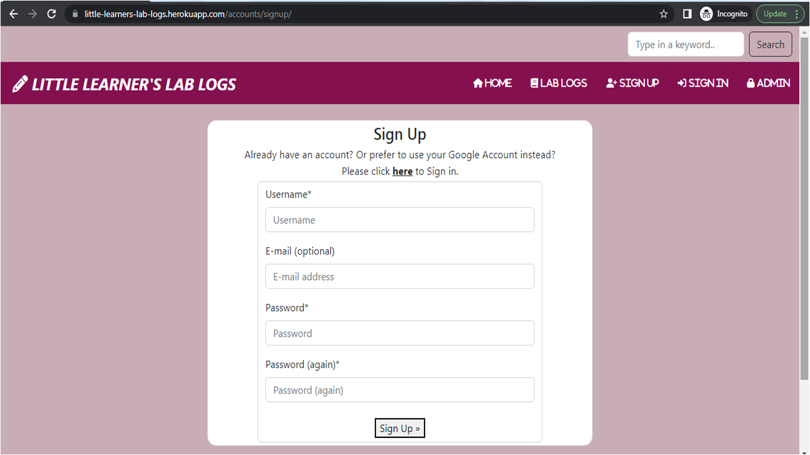
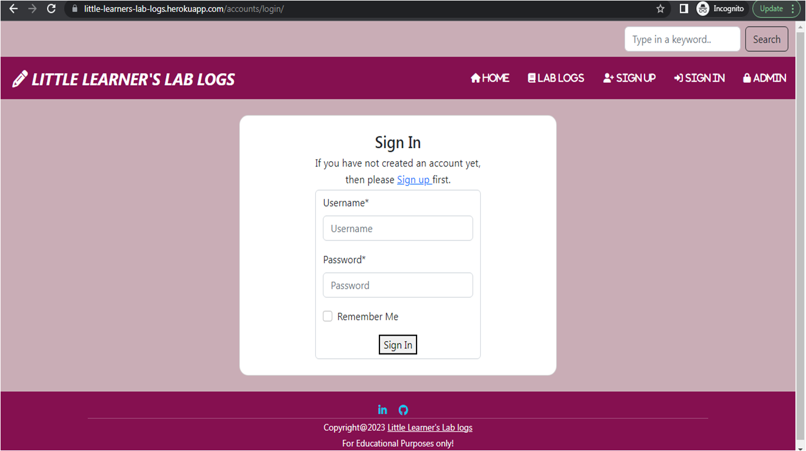
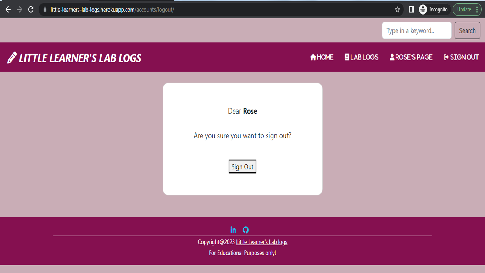
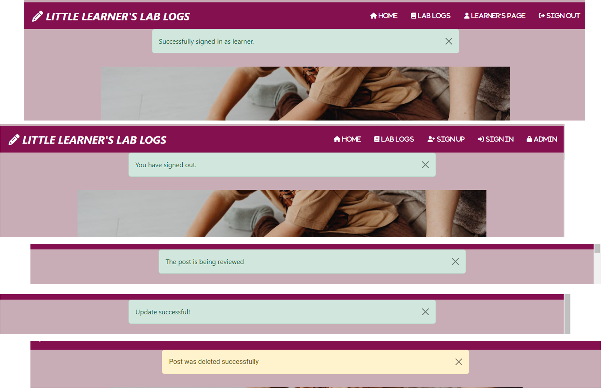
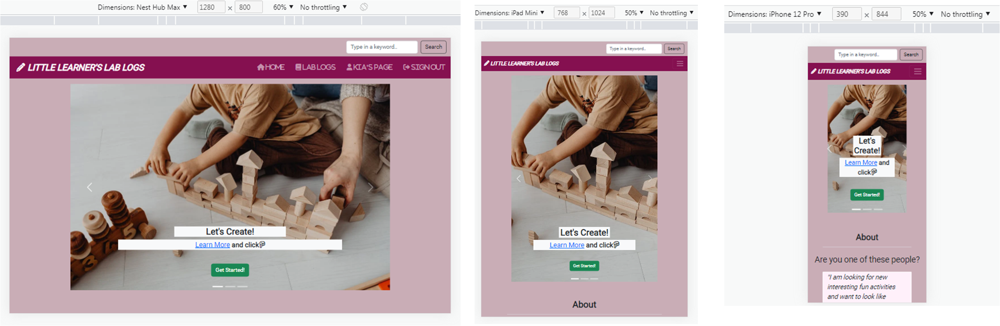

# Welcome to **[Little Learner's Lab Logs](https://little-learners-lab-logs.herokuapp.com/)**

## PERSPECTIVE
The main inspiration behind creating this website is a little curious learner, my little boy. When he started missing his normal visits to playgrounds during the winter break, he was on a constant lookout for activities around the house. Being among the large percentage of parents who wish to keep their kids engaged throughout the day, I started the quest of finding simple small fun activities that can be performed with the items available in the house. To find those activities, the best source is kids websites. Then followed a thought, what if one can perform the fun experiments and also can log the observations for others to read and repeat..  
With this idea, I created "Little Learner's Lab Logs" which started for a little learner and after its creation, I see that it appeals to all the little scientists hidden within us too. The user of this website could be a little kid referring to these logs for fun or a student who wishes to learn and create logs of their own. Not to mention it's a great place for parents, who can help their kids learn new concepts along with having fun. And for teachers, this could be a site where their students can enter their observations and understand the scientific methodology better.  
The aim is to collect simple fun-filled small experiments for the Learners created by the Learners. 

## [Contents](#contents)
- [User Experience (UX)](#user-experience-ux)
	- [Site Goals](#site-goals)
	- [User Personas](#user-personas)
	- [Scope](#scope)
- [Agile Methodology](<#agile-methodology>)
    - [Epics and User Stories](<#epics-and-user-stories>)
        - [Website UI](<#website-ui>)
        - [Registration and Account Management](<#registration-and-account-management>)
		- [Lab Log Post Management](<#lab-log-post-management>)
		- [Comment and Like Management](<#comment-and-like-management>)
    - [Acceptance Criteria](<#acceptance-criteria>)
	- [Tasks](<#tasks>)
	- [User Story Management](<#user-story-management>)
- [Design](<#design>)
	- [Colours](<#colours>)
	- [Typography](<#typography>)
	- [Imagery](<#imagery>)
	- [Wireframes](<#wireframes>)
    - [Database Schema](<#database-schema>)
- [Features](<#features>)
	- [Home Page](<#home-page>)
        - [Search Button](<#search-button>)
		- [Navbar](<#navbar>)
		- [Hero-image](<#hero-image>)
		- [About](<#about>)
		- [Getting Started](<#getting-started>)
		- [Latest Entries](<#latest-entries>)
		- [Footer](<#footer>)
	- [Lab Logs](<#lab-logs>)
	- [Log Details](<#log-details>)
	- [My Page](<#my-page>)
		- [Add Logs](<#add-logs>)
		- [Edit Logs](<#edit-logs>)
		- [Delete Logs](<#delete-logs>)
	- [Security](<#security>)
		- [Sign Up](<#sign-up>)
		- [Sign In](<#sign-in>)
		- [Sign Out](<#sign-out>)
	- [Admin](<#admin>)
	- [Alert Messages](<#alert-messages>)
- [Technologies](<#technologies>)
	- [Languages Used](<#languages-used>)
	- [Frameworks, Libraries and Programs](<#frameworks-libraries-and-programs>)
- [Production](#production)
	- [Django](<#django>)
- [Testing](<#testing>)
	- [User Story Testing](<#user-story-testing>)
	- [Testing Technologies](<#testing-technologies>)
		- [Manual Testing](<#manual-testing>)
			- [Validation](<#validation>)
- [Issues and Fixes](<#issues-and-fixes>)
- [Deployment](<#deployment>)
	- [Heroku](<#heroku>)
- [Credits and Resources](<#credits-and-resources>)
	- [Code](<#code>)
	- [Learning Resources](<#learning-resources>)
	- [Content](<#content>)
	- [Media](<#media>)
- [Acknowledgements](<#acknowledgements>)

# User Experience (UX)

## Site Goals
- Little Learner's Lab Logs is a website mainly meant for curious kids of all ages, where they can explore, create activity logs and also post fun science experiments that could even be performed at home. 
- It is also an useful site for busy parents, who wish that their children to learn new scientific concepts through simple fun experiments. 
- It is also a place for those passionate teachers who want to encourage their students to be motivated to learn science and be intuitive about the scientific concepts around them. 
- All users who sign up and sign in, can access all the features of the website and can create, edit, and delete their posts.

## User Personas 
As mentioned in Site Goals, the users expected to be visiting this website regularly are going to be kids, students, parents and teachers. I created 4 fictional characters which represents the target users. The user personas with their needs, goals and frustrations are enlisted, which helped me design this website with a point of view of distinct users.
The link to User Personas can be found [here](docs/agile/user_personas.pdf).

## Scope
- An attractive and intuitive UX experience: 
	1. Website title focus kids as primany users
	2. Hero-image with information on the site's purpose
	3. Responsive design
	4. A clear and straightforward layout
	5. Footer fixed at the bottom with links to social media
	6. The user knows which page they are on by the name that appears on the head of each webpage and also using the slug information on the address bar
	7. Implement alert messages to provide users with more feedback after they take certain actions

- An easy navigation for the user through all the pages and features
	1. Navigation Menu with easy access to all links.
	2. Easy Sign Up/ Sign In/ Sign Out functionality visible.
	3. Content guiding users how to start using the websites features
	4. Description of features that would suite different users' needs 
	5. Hero image guidance to sign up/sign in
	6. Search field for the user to get to the log post by searching a keyword
	7. Back to Top button to facilitae user to go to top in homepage as it is rather long

- Lab Log posts features
	1. Latest entries feature on the landing page
	2. Exclusive page for all the log posts
	3. On a click they can view log post details
	4. Ability to be able to search for log posts
	5. Ability to comment on/like log posts
	6. Create, Edit and Delete log posts
	7. Ability to add/edit and remove log posts in user's personal page

## Agile Methodology
Throughout this project, an agile approach was taken in order to develop the website  Each activity was broken down into  manageable actions from initially creating 4 Epics, which were then broken down into smaller User Stories. Each of the user stories then had different acceptance criteria. The status, comments and details of each Epic along with the associated User Stories can be found in the kanban board linked [here](https://github.com/users/RoshnaVakkeel/projects/2/views/1). This made the overall project much more manageable to build. 

## Epics and User Stories
4 Epics were created which were further developed into 15 User Stories. The initial conception was done using google sheets. The link can be found [here](docs/agile/epics_and_user_stories.xlsx).

### Website UI
[Epic 01: Little_Learner's_Lab_Logs website UI #1](https://github.com/RoshnaVakkeel/Little_Learners_Lab_Logs/issues/1)
Epic Goals for End User:
1. An intuitive User Interface with easy to use navigation
2. A means of viewing the full list o blogs including likes
3. functionality to allow users to register, sign in and sign out
4. Upon signing in, the user should be able to like, comment on the log posts

Related User Stories:
1. [USER STORY US01: Intuitive User Interface #2](https://github.com/RoshnaVakkeel/Little_Learners_Lab_Logs/issues/2):
	As a Site user I can see a well defined landing page so that I can easily understand the purpose and main features of the website.
2. [USER STORY US02: Site pagination#3](https://github.com/RoshnaVakkeel/Little_Learners_Lab_Logs/issues/3):
	As a Site user I can view a well paginated website so that navigate easily to different features offered.
3. [USER STORY US03: Log Posts Display#4](https://github.com/RoshnaVakkeel/Little_Learners_Lab_Logs/issues/4):
	As a Site user I can see the collection of log posts at a glance so that I can find the lab log posts of my choice.
4. [USER STORY US04: User Registration/Sign Up Link#5](https://github.com/RoshnaVakkeel/Little_Learners_Lab_Logs/issues/5):
	As a Site user I can easily see a registration button and sign up option so that I can register to access all create, edit and delete functions offered by the website.

### Registration and Account Management
[EPIC 02: Registration and Account Management #6](https://github.com/RoshnaVakkeel/Little_Learners_Lab_Logs/issues/6)
Epic Goals for End User:

1. Easy registration of an account
2. Easy Sign Up, Sign in and Sign Out
3. Confirmation upon signing in 
4. Upon signing in, the user should be able to like, comment on the lab log post posts
5. Easy access to Create, Read, Update and Delete (CRUD) features upon signing in
6. Visibility of personalized lab log posts and comments

Related User Stories:
1. [USER STORY US05: Account Creation#7](https://github.com/RoshnaVakkeel/Little_Learners_Lab_Logs/issues/7):
As a Site user I can create an account by registering my details so that I can comment, like, create and edit lab log posts
2. [USER STORY US06: Account Confirmation #8](https://github.com/RoshnaVakkeel/Little_Learners_Lab_Logs/issues/8):
As a Site user I can I get a message upon signing up so that I can know that my account registration was successful.
3. [USER STORY US07: Sign In and Sign Out Features #9](https://github.com/RoshnaVakkeel/Little_Learners_Lab_Logs/issues/9): As a registered Site user I can easily Sign in or Sign Out so that I can access my personal log posts and comments.
4. [USER STORY US 08: User Personal Page Features#10](https://github.com/RoshnaVakkeel/Little_Learners_Lab_Logs/issues/10):
As a registered Site user I can see my personal page so that I can create my own lab log posts and edit or delete them.

### Lab Log Post Management
[EPIC 03: Lab Log Post Management#11](https://github.com/RoshnaVakkeel/Little_Learners_Lab_Logs/issues/11)

Epic Goals for End User:

1. Create lab log posts. 
2. View their created lab log posts
3. Update/Edit personalized lab log posts
4. Delete lab log posts

Related User Stories:
1. [USER STORY US09: Add Lab Log Posts#12](https://github.com/RoshnaVakkeel/Little_Learners_Lab_Logs/issues/12): As a signed-in Site user I can create a lab log post so that I can share my ideas and experiments
2. [USER STORY US 10: View/Read Lab Log Posts #13](https://github.com/RoshnaVakkeel/Little_Learners_Lab_Logs/issues/13): As a signed-in Site user who created a lab log post I can read my post with my name among other log posts on homepage so that I can share my log posts with others.
3. [USER STORY US 11: Edit Lab Log Posts #14](https://github.com/RoshnaVakkeel/Little_Learners_Lab_Logs/issues/14):As a signed-in site user I can edit and update a lab log post I created so that I can make additions, edit, correct the entries I made in the log post.
4. [USER STORY US 12: Delete Lab Log Posts#15](https://github.com/RoshnaVakkeel/Little_Learners_Lab_Logs/issues/15): As a signed-in site user I can choose to delete a lab log post I created so that I publish only the log posts of my choice.

### Comments and Like Management
[EPIC 04: Comments/Likes Management #16](https://github.com/RoshnaVakkeel/Little_Learners_Lab_Logs/issues/16)

Epic Goals for End User:
1. Add and see Comments 
2. Add/remove Likes

Related User Stories:
1. [USER STORY US 13: Post Comments #17 ](https://github.com/RoshnaVakkeel/Little_Learners_Lab_Logs/issues/17): As a signed-in site user I can add a comment on any lab log posts so that I can express my opinion about a topic of my choice.
2. [USER STORY US 14: Site Owners Approval of Comments #18](https://github.com/RoshnaVakkeel/Little_Learners_Lab_Logs/issues/18): As a site owner and admin I can review and then approve or disapprove comments so that unsuitable comment can be filtered out as children also would be site users.
3. [USER STORY US 15: Add or Remove Likes on a Post#19](https://github.com/RoshnaVakkeel/Little_Learners_Lab_Logs/issues/19): As a signed-in site user I can add like to the lab log posts I liked so that I can guide other users to select simple experiments that may be more interesting.

## Acceptance Criteria
For all the User Stories, Acceptance Criteria was also mentioned. The purpose of this was to provide a reference point for the developmental steps. I made sure to cross-check that all the required steps intended was implemented. It also helped with Testing to make sure that all the necessary aspects and features were covered. The acceptance criteria is described on the column next to the user stories (column H) [here](docs/agile/epics_and_user_stories.xlsx).

## Tasks
The tasks for the website development process was closely followed as mentioned in CI's Django module "I Think Therefore I Blog" walkthrough project. The task is generally the developers step towards preparing the app.
The tasks that I have followed during the development phase were carried out in this order.

**Before Project Inception**

- Design ERD and Data 
- Create Repository in GitHub
- Create Project, Epics, User Stories and prepare Kanban Board

**Creation of Project in GitPod**

- Install django - pip3 install 'django<4' gunicorn
- Install supporting libraries - pip3 install dj_database_url psycopg2
- Install Cloudinary Libraries - pip3 install dj3-cloudinary-storage
- Create requirements file - pip3 freeze --local > requirements.txt
- Create Project (little_learner_lab-logs) - django-admin startproject PROJ_NAME little_learner_lab-logs . 
- Create App (logs) - python3 manage.py startapp logs
- Update settings.py
- Migrate Changes - python3 manage.py migrate

- Deploying app to Heroku - Check [Heroku](<#heroku>) for details
	- Create external database on elephantsql.com
	- Create the Heroku app - little-learners-lab-logs
	- Attach the database in Gitpod
	- Prepare our environment and settings.py file
	- Get static and media files stored on Cloudinary

- Create Database Models
	- Set up models.py file in "logs" directory
- Build Admin site
- Set up Templates
	- Create base.html - Navbar and Footer content, which gets extended to all the other template files
	- Add responsiveness to navigation and footer
    - Create index.html, view and style
	- Set up template file features with views.py and urls.py
		- lab_logs.html (for all log post collections)
		- my_page.html (for user's personal collections)
		- log_details.html (for full log post view)
		- add_logs.html (to allow user input for log posts)
		- edit.html (to allow user to edit their input for log posts)
		- delete_logs.html (to allow user to delete their own log posts)
- Install Allauth for sign in, sign up and sign out tenplates with-  pip3 install django-allauth 
	- Install crispy-forms to add styles to Django account templates with-  pip3 install crispy-bootstrap5
- Intensive Manual Testing and Validation checks of each page and codes written
- Final Deployment steps

**Future Tasks**
- Automated Testing (due to time restraint, I couldn't perform them)
- Email verification and password recovery settings

## User Story Management
To manage the User Stories for the project, Github Project was created with Kanban board, which can be seen [here](https://github.com/users/RoshnaVakkeel/projects/2/views/1).

- User stories were clubbed under Epics to divide the project into main categories.
- Each of the stories was added to the project using User Story templates, and then were allocated to the relevant column. 
- All the User stories were initially entered in the 'To Do' column, then during development story they were moved into the 'In Progress' column, and then finally they get moved into 'Done' once the development completes.
The progress can be seen [here](docs/agile/agile_kanban_progress.pdf).

[Back to top ⇧](#contents)

## Design
### Colours
- The colour scheme has considered based on easy accessibility for all. 
- Complimentarity was key feature in color selection, to give it a pleasant feel for all age groups.
- The colors have been consistently maintained throughout the website.

The palette was generated with inspiration from palettes provided by [Lilybug Graphic Design -Colour Wall](https://www.lilybugdesign.co.nz/colour-wall). The chosen palette of colors was generated from the graphic: [Tropical palette](docs/features/tropical-palette.jpg). The colours were modified using [Colorswall](https://colorswall.com/palette/227413). 
The colors were generated referring to the Tropical palette in colorswall palette Generator. The generated palette was:
 
These were the colors for the body (scented frill - #c9adb6) and (variant of deep pink - #851050) was chosen for navbar and footer.

### Typography
- Fonts were imported using Google Fonts. Roboto was used throughout with a backup of sans-serif. It was chosen for easy readability for users. 
- UTF-8 Symbols 

### Imagery
The imagery on the website has been seleced according to young users. The images chosen depict children engaged in different activities. The pictures selected are with range of colors. Usually experiments are meant to be colorful. The carousel was chosen to show hero-image because one picture cannot represent the whole theme of the website.
All images were taken from [Pexels](https://www.pexels.com/).

### Wireframes
The wireframes were generated at the start of the project suing Balsamiq. After referring to different bootstrap templates, pages were divided into the different relevant sections. 
The finished website closely fololows wireframes as the designs were adapted during development but overall structure was kept constant. For eg. an additional 'About' section was introduced in order to guide the user. A search field and button was also introduced. 

The wireframes can be found in these links: 
[Wieframes for Desktop](docs/wireframes/PP4_project_wireframe_desktop.pdf) 
[Wieframes for Tablet](docs/wireframes/PP4_project_wireframe_tablet.pdf) 
[Wieframes for Mobile](docs/wireframes/PP4_project_wireframe_mobile.pdf)

### Database Schema
Smart Draw was used to create a database schema to visualise the types of custom models the project requires. This schema was used as a guide to what needed to be added to each model. Below is the Database structure that this project is based on. The relationship between Entities User, Post and Comment are shown here. 

[Back to top ⇧](#contents)

# Features

## Home Page
Homepage provides the user with some quick information on how to start using the site and make use of all its features.  It helps them decide if they would like to continue to read the log posts or create them. Users do not need to be registered to view a log post. 

Homepage or the Landing page has these key features: 

Visible at first glimpse:
1. Search input field and button
2. Navigation Menu
3. Hero-image

The appearance of the homepage on a desktop is shown below

The homepage with responsive features on a mobile device is shown 
[here](docs/features/home_full_mobile.pdf).

Upon scrolling down:
1. About Section
2. Getting Started
3. Latest Entries
4. Footer

Details to each section has been provided below in detail.

### Search Button 
- On the top right corner, a search input field is provided along with a button to submit. 
- Any user can search any query using keywords and a new search page will appear containing Search Results. 
Click [here](docs/features/search_result.png) to see it the way it appears on desktop.
Click [here](docs/features/search_results_mobile.pdf) to see it the way it appears on mobile phone.

### Navbar
- The responsive navigation bar is featured on all pages. 
- The purpose of this feature is to allow users to navigate all pages easily across all devices without having to use a back button to get to the next page. 
- It has active links to different pages. For mobile view, the navbar transforms to a burger menu. 
- Navbar features two types of views/ navigation menu items depending on if the user is logged in or logged out. 
- This feature is introduced for better user guidance. 

**User is not signed-in or is signed-out**

The navbar will prompt to Sign Up, Sign In or log in as Admin. The navigation menu as on the desktop will appear as shown below. 

 

On a mobile device, the Navbar will appear as a collapsable burger menu. If the toggle button is clicked, the nav menu items will appear as a column as shown [here](docs/features/navbar_mobile.png)

**User is signed-in**

If the user is signed in (username Rose is provided as an example here). The navbar will in this case feature "User's" Page and Sign Out options.
On a desktop, the navigation menu will appear as shown below:

On a mobile device, the Navbar will appear as a collapsable burger menu. If the toggle button is clicked, the nav menu items will appear as a column as shown [here](docs/features/navbar_signed_in_mobile.png)

### Hero-image
- The Hero-image is introduced in a Carousel that enables a slideshow for cycling through elements. As the theme cannot be depicted in just a picture, my idea was to give three pictures with three captions. The captions would also prompt the user to sign in or sign up. 
- Besides that, it will also contain links to different sections within the homepage such as About and Getting Started for user guidance, and to Latest Entries section to draw user's attention to the different log posts. 
- It will appear diffently to signed-in and signed-out users.

**User is not signed-in or is signed-out**
- User can see Sign In or Sign Up button.
- Upon clicking on "Learn More" link: The "About" section of Homepage will be loaded.
- Upon clicking on "Get Started" link: The "Getting Started.. Your Guide" section of Homepage will be loaded.
- Upon clicking on "Latest Entries" link: The "Latest Entries" section of Homepage will be loaded.
The pictures with different links can be found [here](docs/features/hero_image.png). 

**User is signed-in**
- Instead of Sign In or Sign Up button, user can see "Get Started" button on all three images, clicking which, the user will be taken to User's personal page.
The pictures with different links can be found [here](docs/features/hero_image_signed_in.png). 

### About
About section asks the users questions about which kind of user persona they associate with and helps them understand the ways they can make use of the different features of the website. It also presents a welcome note for the users. 
Check it out [here](docs/features/about.png).

### Getting Started
This section describes how each user can use the functionalities available in the website. The user esp. a student or a kid would need guidance on how website features can be accessed. The links are provided at each step, which can directly open the links as the respective pages. 
The section can be seen [here](docs/features/getting_started.png).

### Latest Entries
- The lab log posts is paginated in a way that only the latest 3 log posts are displayed on Home page. 
- This has been implemented so as not to overwhelm the user with the whole list.
- It is set in descending order by the date of creation, meaning the latest will be the first post visible.
- It shows the lab log post title (clicking on which, the log post details can be seen), image uploaded by the user, author name, two lines of description followed by the date and time of creation along with the number of like the log post received. 
The section can be seen [here](docs/features/latest_entries.png).

### Footer
- Each page has the same footer at the bottom containing Copyright information, link to homepage and a note that this website is meant for Educational purposes only.
- The footer section includes links to my social media site [Linkedin](https://www.linkedin.com/in/roshna-vakkeel/) and my [GitHub](https://github.com/RoshnaVakkeel/Little_Learners_Lab_Logs) page which opens up in a new tab to allow easy navigation for the user. 

[Back to top ⇧](#contents)

## Lab Logs

- This page enlists all the log posts added so far to the website. 
- The oldest post will be visible on top. The lab log posts is paginated in a way that 12 posts are displayed. Further post can be accessed by clicking next button that would appear as more than 12 log posts will created. 
- This page will look similar to both signed-in and signed-out users. 
- The purpose is to show the whole collections and give users the choice whether to sign in or not.
- Each log post has a title followed by the authors name and date it was submitted. It shows the image, lab log post title (clicking on which, the log post details can be seen), image uploaded by the user, author name, two lines of description followed by the date and time of creation along with the number of like the log  post received. 
The screenshot as it can be seen on a desktop can be seen [here](docs/features/lab_logs.png).

The full as it can be seen on a mobile device can be seen [here](docs/features/lab_logs_mobile.pdf).

### Log Details
- When a user clicks on the title of the lab log post, they are brought to the Log Details page for the selected log post. Here the user is shown a full description of the log post, its full description, items required, steps to perform. 
- This page will be show also the number of likes and all the comments the log post has received irrespective of the user being signed-in or signed-out. 
- But the Edit and Delete button and comments input boxes will be visible to different users differently. 
The features that would be accessible to the user is described below:

**Log Details for the User who is not signed in**
- They can read the log post
- They can read the comments, cannot post them
- They can see the likes, cannot like them
The way log post detail page  will appear to the user on a desktop can be seen [here](docs/features/post_detail_not_signed_in.png)

**Log Details for the User who is signed in**
- They can read the log post
- They can read the comments
- They can post comments
- They can see the likes, and like them
In an example here, Elizabeth is signed in but the author is learner. The way log post detail page  will appear to her can be seen [here](docs/features/post_detail_signed_in_not_author.png)

**Log Details for the User who is signed in and is the author of the log post**
- They can read the log post
- They can read the comments
- They can post comments
- They can see the likes, and like them
- They can see an edit buttoon and can edit their own log post
- They can see an delete buttoon and can delete their own log post
If the author is learner and learner is signed in. The way log post detail page  will appear to them can be seen [here](docs/features/post_detail_signed_in_author.png)

## My Page
- This page will be only visible to signed-in users.
- Navbar will show this page with their username on it. For eg. For user: learner, it will appear as Learner's Page.
- If the user had no posted anything earlier, user will be shown that there are no posts and they can create. 
It will appear as shown [here](docs/features/my_page_no_posts.png)

If they click "Create Now" button, they will be taken to "Add Logs" page.

### Add Logs
- If the user is signed-in, they can create a lab log post. 
- If they click "Create Now" button in user's personal page, they will be taken to "Add Logs" page.
- The input fields include title (needs to be unique), description, items required (using the summernote editor), steps to perform (using the summernote editor), image upload button and a Submit button.
- User will be prompted to fill each input field. 
- Upon submission, user will be prompted by an alert message that the post is being reviewed.
On a desktop, the page appears as shown [here](docs/features/add_logs.png)

On a mobile device, the page appears as shown [here](docs/features/add_logs_mobile.pdf)

### Edit Logs
- If the user is signed-in and is a author to the log post, they only can edit it. 
- If they click Edit button visible in "Log Details" page, they will be taken to "Edit Logs" page.
- The filled input fields include title (needs to be unique), description, items required (using the summernote editor), steps to perform (using the summernote editor).
- Image upload button will read "Change Image" and after making changes the can click "Update" button.
- Upon clicking Update, user will be prompted by an alert message "Update Successful".
- They can see their old input or write-up to compare the new edit and the old inputs.
On a desktop, page appears as shown [here](docs/features/edit_logs.png)

On a mobile, page appears as shown [here](docs/features/edit_logs_mobile.pdf)

### Delete Logs
- If the user is signed-in and is a author of the log post, they only can delete it. 
- If they click "Delete" button visible in "Log Details" page, they will be taken to "Delete Logs" page.
- They will be asked if they are sure to proceed.
- Upon clicking Update, user will be prompted by an alert message that the log post is successfully deleted.

The page appears as shown [here](docs/features/delete_logs.png)

## Security
In order to properly interact with the website, the user needs to have an account and sign in. This ensures security of their log posts and gives them rights to create, modify and delete them.

### Sign Up
- User is asked to enter username and password to sign up.
- Email is kept optional as kids can access it without email id.
- User will be guided by validation messages if the username exists or password is too small.
- This was created by modifying Django inbuilt templates

On a desktop, Sign Up page appears as shown:

On a mobile phone, Sign Up page appears as shown [here](docs/features/sign_up_mobile.pdf)

### Sign In
- User can enter username and password and sign in.
- User will be guided by validation messages if the username or password is not correct.
- This was created by modifying Django inbuilt templates.

### Sign Out
- If the user is signed-in, then only they can see this nav-item in navbar
- User will be taken to the Sign Out page
- This was created by modifying Django inbuilt templates
- When the user signs out, they are redirected to homepage

On a desktop, Sign Up page appears as shown:

On a mobile phone, Sign Up page appears as shown [here](docs/features/sign_out_mobile.png)

## Admin
- If the signed in user adds contents to the "Add Logs" form and submits it, users will be prompted by a message "The post is being reviewed". This is because the information will not be published until after it gets approved by the admin. 
- Admin accesses the project via logging into Django admin with a superuser id and password.
- A superuser "learner" was created for this project to manage the backend admin section. 
- Admin can access all the functionalities such as create, read, update and delete information like users, posts and comments.
- Admin account's link is provided in the navigation bar, when no user is signed in. 
- Upon clicking "Admin" menu item Django admin log in page opens.
The page appears as shown [here](docs/features/admin_login.png)

Upon logging in using superuser id and password, the admin site opens. Admin can access all the features and manage the entries made such as user, posts and comments. 
The page appears as shown [here](docs/features/admin_landing_page.png)

**Admin Post Management**

Upon selecting "Post" option, the list of log posts along with its stutus will be displayed. Admin can select the post and can edit or delete its data.
The page appears as shown [here](docs/features/admin_posts_page.png)

When the admin selects a user's log post, the page opens with all its details and entries that can be modified by the admin. 
- When the lab log post is submitted by the user, by default its status is set to draft. 
- Upon admin approval, when status is set to published, the post becomes visible in the website.
The selected log post in admin site appears as shown [here](docs/features/admin_posts_management.png)

**Admin Comment Management**

Upon selecting "Comment" option, the list of comments will be displayed. Admin can select a comment and can edit or delete its write up.
The page appears as shown [here](docs/features/admin_comments_page.png)

When the admin selects a user's comments, the page opens with all its details that can be modified by the admin. 
- When the lab comment is submitted by the user, it gets published immediately. 
- Upon admin disapproval, the comment can be easily removed or deleted.
The selected log post in admin site appears as shown [here](docs/features/admin_comment_management.png)

## Alert Messages
- Alert messages have been implemented to provide users with more feedback after they take certain actions. 
- This helps users know their desired actions have occurred.
- It stays active for 2 seconds and fades away automatically. This was done for good user experience.
The examples are as depicted in the picture: 

[Back to top ⇧](#contents)

## Technologies
### Languages Used]
- [CSS](https://en.wikipedia.org/wiki/CSS)
- [HTML5](https://en.wikipedia.org/wiki/HTML5)
- [JavaScript](https://en.wikipedia.org/wiki/JavaScript)
- [Python](https://en.wikipedia.org/wiki/Python_(programming_language))

### Frameworks, Libraries and Programs

**Frameworks**
-   [Django](https://www.djangoproject.com/) was used as the framework for the back-end logic of the project. Django enables rapid and secure development.
-   [Bootstrap](https://getbootstrap.com/) was used to render layout and responsiveness of the website.

**Programs**
-   [Git:](https://git-scm.com/) was used for version control by utilising the Gitpod terminal to commit to Git and Push to GitHub.
-   [GitHub:](https://github.com/) is used as the respository for the project code after being pushed from Git. In addition, for this project GitHub was used for the agile development aspect through the use of User Stories (GitHub Issues) and tracking them on a Kanban board.
-	[Google Chrome Developer Tools](https://developers.google.com/web/tools/chrome-devtools) was used to inspect page elements, debug, troubleshoot and test features and adjust property values. Using the Lighthouse extension installed in Chrome Browser, the performance report was generated.
-   [Smartdraw](https://cloud.smartdraw.com/) was used to create the Entity Relationship diagrams for the data model
-   [Balsamiq:](https://balsamiq.com/) was used to create the wireframes during the design process.
-	[Favicon](https://favicon.io/favicon-generator/) - used for creating a favicon for the site
-   [Google Fonts:](https://fonts.google.com/) used for the Roboto font
-   [Font Awesome:](https://fontawesome.com/) was used to add icons for aesthetic and UX purposes.
-   [Gunicorn](https://gunicorn.org/) was used as the Web Server to run Django on Heroku
-   [psycopg2](https://pypi.org/project/psycopg2/) database adapter used to support the connection to the postgres db
-   [Cloudinary](https://cloudinary.com/) used to store the images used by the application
-   [Summernote](https://pypi.org/project/django-summernote/) used to provide WYSIWYG editing on the "Add Logs" page in order to add items_required and steps_to_perform input fields in the form.
-   [Django crispy forms](https://django-crispy-forms.readthedocs.io/en/latest/) used to simplify form rendering
-	[Heroku](https://www.heroku.com/) - used to host and deploy the live website

**Libraries**
-	[Django allauth](https://django-allauth.readthedocs.io/en/latest/index.html)  - was used to implement account authorisation and providing associated templates
-   [dj_database_url](https://pypi.org/project/dj-database-url/) library used to allow database urls to connect to the postgres db
-	[Crispy forms](https://github.com/django-crispy-forms/django-crispy-forms) and [Crispy bootstrap5](https://github.com/django-crispy-forms/crispy-bootstrap5) - used for styling forms in the Django templates
-   [jquery library](https://ajax.googleapis.com/ajax/libs/jquery/1.12.4/jquery.min.js) used to fade out alert messages

## Production
### Django 
**Installation and Set Up**

This website is built on the Django framework. To set up a Django project, the necessary dependencies were installed. This project uses the old versions as mentioned in CI's Django wakthrough project "I think therefore I blog"
This needs these steps to be followed:

Within the development environment, 
1. install Django using the command:
~~~
pip3 install 'django<4' gunicorn
~~~
This installs Django (the framework) and gunicorn (which is a WSGI HTTP server that will be used by the site).

2. Then install the libraries `psycopg2` and `dj_database_url==0.5.0 psycopg2` using the command line:
~~~
pip3 install dj_database_url==0.5.0 psycopg2
~~~
These libraries are needed for connecting to the database.

3. As this site uses Cloudinary to store files, this needs to be installed with:
~~~
pip3 install dj3-cloudinary-storage
~~~
This allows the site to use Cloudinary for storing and serving files

4. Once all the dependencies are installed, generate a requirements.txt document for them by using:
~~~
pip3 freeze --local > requirements.txt
~~~
This will store the dependencies of the project in a file called requirements.txt

5. Next, start a new Django project using the command:
~~~
django-admin startproject <project-name> .
~~~
(don't leave off the dot at the end as this determines where the project is created).

In my case, it was:
~~~
django-admin startproject little-learners-lab-logs .
~~~

6. Migrations need to be run to set the database up, this can be done with:
~~~
python3 manage.py migrate
~~~

7. Finally, you can commit and push your changes to GitHub using :
~~~
git add .
git commit -m "initial commit
git push
~~~

****

[Back to top ⇧](#contents)

## Testing

### User Story Testing
 - All the User Stories in the [User Experience (UX)](#user-experience-ux) enlisted had different Acceptance Criteria. 
 - Acceptance Criteria mentions the key features that needed to design and create the user experience as expected. 
 - User stories were matched with the features and were cross-checked whether all the features as per the mentioned criteria exists in the website.
 - All Criteria got a pass as result 
 This excel document shows the list of Acceptance Criteria, the matching features and the links to the features: [User Story Testing](docs/validation/user_story_testing.xlsx)

### Testing Technologies 
The testing is broken into categories: manual and validation. Details can be found below.

### Manual Testing
An exhaustive list of features and functions were checked on different devices and browsers. They were performed and their scrrenshots can be found in the features section on how the distinct features render. The exhaustive list and the test results can be found [here](docs/validation/llll_manual_testing.xlsx).

**Browser Compatibility**

- The website was manually tested the website on 3 different browsers: Chrome, Mozilla Firefox and Microsoft Edge (Desktop) and Safari(mobile phone). In all the browsers the website functions very well and all the features work similarly. 

**Responsiveness in different device sizes**
In addition, I also tested it on my own mobile with Safari search engine, and had a number of friends and family test it on their phones, tablets and laptops. 
The pages render well in all the devices in a responsive manner.

The homepage comparison in different devices is shown below:

The homepage with responsive features on a mobile device is shown 
[here](docs/features/home_full_mobile.pdf).

**User's Testing Experience**

There are a number of accounts and lab log entries that already exist in the database, which were created by different users specifically for testing purposes. The yongest user was 13 year old student. 

This testing consisted of checking:
- The website functioned as expected
- Working of all the links
- Submission of log posts and comments
- JavaScript functioning
- Edit and delete functions
- Sign Up, Sign in and Sign Out features Testing

**User's Testing Feedback Implementation**
 Almost 12 users have signed up for testing of the website other than me. All the feedbacks were taken into account and improvements were made in the website to boost UX.
 The suggestions were:
 - Better link contrast
 - Back to Top button
 - Add boxes to blockquotes and add a detailed About section
 - Error 500 upon signing up - Few users reported about this error. 
 It was fixed by adding this in settings.py file:
 ****
 ACCOUNT_EMAIL_VERIFICATION = "none"
 ****

#### Validation
I used the following validation tools

- HTML using [W3C HTML validator](https://validator.w3.org/)
- CSS using [Jigsaw CSS validator](https://jigsaw.w3.org/css-validator/)
- Site performance via [Lighthouse](https://developers.google.com/web/tools/lighthouse)
- Accessibility via [WAVE Web Accessibility Evaluation Tool](https://wave.webaim.org/)
- Python via [PEP8 CI Python Linter](https://pep8ci.herokuapp.com/)

Results obtained are as follows:

##### HTML Validation 
All the Django templates html files hava been validated by manually copying the source of the rendered pages and then validating using the W3C Validator (link shown above). Each test result shows the source url. The results can be seen [here](docs/validation/w3c_validation_results_html.pdf).

##### CSS Validation 
[Jigsaw CSS validator](https://jigsaw.w3.org/css-validator/) was used for validating the CSS stylesheet. CSS file was tested by manually copying the CSS codes into the manual input option. The result can be seen [here](docs/validation/w3c_validation_CSS.png).

##### Lighthouse Test
[Lighthouse](https://developers.google.com/web/tools/lighthouse) tool was used for analysing the performance, accessibility, best practices and SEO of the website. The results are summarised [here](docs/validation/lighthouse_report.pdf).

##### WAVE Accessibility Test
[WAVE Web Accessibility Evaluation Tool](https://wave.webaim.org/) was used to check web accessibility. Only the certain contrast errors were reported. It was due to link contrast with the background. I used primary link color blue in hero-image caption for better guidance for the user, so that they identify that it is a link rather than using black color as suggested by the tool. This error was deliberately ignored. No other errors were reported. The results can be found [here](docs/validation/wave_accessibility_test.pdf). 

##### PEP8 Python Linter Test
- [PEP8 CI Python Linter](https://pep8ci.herokuapp.com/) was used to check that the Python code meets PEP8 standards. All the errors were also checked periodically before git push to the repository. The tests results can be seen [here](docs/validation/pep8_validation.pdf). 

[Back to top ⇧](#contents)

## Issues and Fixes

**ISSUE 1: Error upon deployment on Heroku**

“ERROR:  Could not build wheels for backports.zoneinfo, which is required to install pyproject.toml-based projects.”
I installed the same old versions of Django as suggested in the Walkthrough project 'I think therefore I blog',  pip3 install 'django<4' gunicorn, pip3 install dj_database_url==0.5.0 psycopg2.
My versions are Django-3.2.16 and psycopg2 2.9.5. First attempt to deploy gave an error message - "ERROR: Could not build wheels for backports.zoneinfo, which is required to install pyproject.toml-based projects"

**FIX:**  

Add python_version<"3.9"; to requirements.txt next to dj_database_url==0.5.0 psycopg2;
Then push the codes to git.
Reference-  https://stackoverflow.com/questions/71712258/error-could-not-build-wheels-for-backports-zoneinfo-which-is-required-to-insta

**ISSUE 2: Issue while connecting static files**

Error upon setting base.url, the css stylesheets didn’t connect properly.
Error in terminal: "GET /static/css/style.css HTTP/1.1" 404 1798
**Fix:** These files were not added in settings.py. Error was solved after adding -
STATICFILES_DIRS = [os.path.join(BASE_DIR, 'static'), ]
STATIC_ROOT  = os.path.join(BASE_DIR, 'staticfiles')

**ISSUE 3: Summernote rendering in form with html tags**

The “Add Logs” page form consists of two text input area using Summernote WYSIWYG editors. But on input, the text posted rendered with HTML tags in drafts. 
Earlier my code only contained: 

{{ form.media }}
{{ form.as_p}}

**Fix:**  

The issue was fixed by safe template tag while displaying in templates in this manner in add_logs.html page:
{{ post.items_required |safe }}
{{ post.steps_to_perform |safe }}
Applying these changes, the text rendered normally.
References used:
https://github.com/summernote/django-summernote/blob/main/README.md
https://stackoverflow.com/questions/61819183/django-why-does-the-text-that-i-placed-in-django-summernote-displays-html-tags

**ISSUE 4: Uploaded image in the “Add Logs” page didn’t render properly**

The image uploaded was not visible in Django admin page in posts section. 

**Fix:** 

According to https://docs.djangoproject.com/en/1.11/topics/http/file-uploads/, 
in forms.py we need to add:
class UploadFileForm(forms.Form):
    title = forms.CharField(max_length=100)
    file = forms.FileField()
    class Meta:
        model = Post
        fields = ['image']

Import class UploadFileForm into views.py file in Logs app directory. Then the image upload functioned correctly. 

**ISSUE 4: Error in the Console due to setTimeout() in alert messages**

Uncaught TypeError: Cannot read properties of null (reading 'defaultPrevented')
    at R.close (alert.js:21:22)
    at (index):429:15 in the codes in script.

**Fix:** 

It was fixed by introducing a try.. catch statement inside the setTimeout handler:
Earlier the code snippet was: 
<!-- Alert message settings -->

It was changed to:
   
Reference: https://stackoverflow.com/questions/41431605/how-to-handle-errors-from-settimeout-in-javascript

**Remaining Issue**

Upon clicking the Previous and Next buttons, next page loading functions work correctly, but each time the page refreshes and the view the user gets is the "Hero-image" section of the homepage. The view must be "Latest Entries" section, after many attempts to fix it, the issue is still pending.

[Back to top ⇧](#contents)

## Deployment
### Heroku
The steps were followed step by step exactly as mentioned in the Django Walkthrough project "I think thereore I blog". The write up attached here was taken from a former CI student's Readme file. Please click [here](docs/deployment/heroku_deployment_steps.pdf) for full description.

[Back to top ⇧](#contents)

## Credits and Resources
### Code
- The basic set up of the website was done by strictly following the steps as described in Code Institue Full Stack Frameworks module - Django walkthrough project "I Think Therefore I Blog".
- Search Button function - [Django Search Using QuerySet and Q() objects](https://python.plainenglish.io/django-search-using-queryset-and-q-objects-299d8e4a7f3b)
- Adding Database forms to "Add Logs" page was learnt from [How To Add Database Forms To A Web Page](https://www.youtube.com/watch?v=CVEKe39VFu8)
- To restrict the log posts description to two lines in "Latest Entries" section and log posts on "Lab Logs" page -[Line Clamp CSS for posts](https://css-tricks.com/almanac/properties/l/line-clamp/)

### Learning Resources
- Code Institutes Full Stack Framework Module, mainly the walkthrough projects.
- Creation of GitHub projects to track issues - [Creating a project Resource](https://docs.github.com/en/issues/planning-and-tracking-with-projects/creating-projects/creating-a-project)
- How Django slugs work?- [Learn Django](https://learndjango.com/tutorials/django-slug-tutorial) 
- Creation of Django commenting system - [Commenting system for a Django 2.X app](https://djangocentral.com/creating-comments-system-with-django/)
- Setting up 404 page - [Django 404 page setting](https://levelup.gitconnected.com/django-customize-404-error-page-72c6b6277317)
- Youtube videos - [Programming with Harry](https://www.youtube.com/watch?v=MxF8YOJI0nU&list=PLK8cqdr55Tsv-D2HMdrnD32oOVBNvmxjr)
- Youtube videos by [Codemy](https://www.youtube.com/watch?v=B40bteAMM_M&list=PLCC34OHNcOtr025c1kHSPrnP18YPB-NFi)

- Different Projects of Code Institute students have been referred: 
1. [John Breedon Bass Tuition](https://github.com/adamhatton/john-breedon-bass-tuition-pp4)
2. [The Newsbox](https://github.com/rashdogg74/newsbox86)
3. [Fungi News](https://github.com/Maya-Claveau/pp4-fungi-news)
4. [The Unconventional Programmer](https://github.com/Jbachtiger/ci-pp4-the-unconventional-programmer)
5. [BANFF National Park Hike Booker](https://github.com/elainebroche-dev/pf4-wayfarers-guided-hikes)

## Content
- All the content in the website has been written by Roshna Vakkeel (the developer), excluding the lab log posts.
- The lab log posts are created by different user's a few were created by me - learner (Admin, Superuser), Elizabeth and Rose.
- The other usernames and users who contributed log posts to the website as a part of testing are:
	- srijith - Anshi (Age: 13, Student)
	- coshione - Kristyna (Age: < 30, Full Stack Developer student)
	- jyoti - Jyoti (Age: < 30, Full Stack Developer student, Mother of two kids)
	- aleezafarrukh - Aleeza (Age: < 30, Scientist and Teacher)
	- jjorly - Jorly (Age: > 20, Student)
	- udayannair - Uday (Age: > 40, Chemist, Father of 1 kid)
	- learner - Me (Age: < 40, Developer, Mother of 1 kid)

## Media
- All pictures were taken from [Pexels](https://www.pexels.com/). Specific URLs have been included within the HTML and CSS code where the files have been used.
- Log posts have images from various sources. Users are encouraged to mention sources.

[Back to top ⇧](#contents)

## Acknowledgements
I would like to acknowledge the following people who have helped me along the way in completing my fourth milestone project:
- My Mentor Elaine B Roche for her guidance, advice and constant encouragement. Her suggestions helped me improve my website well. 
- My fellow students for their company and encouragement. Special thanks to Kristyna Maulerova, Tony Albania, Jtoyi Yadav for their encouragement, support and for testing my website, adding posts and comments.
- My dear friends and family members, especially my Angel niece Anshi, who tested the website and gave valuable feedback.
- My tutors who helped me solve issues when I had them.

[Back to top ⇧](#contents)
